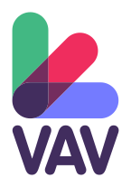

<p align="center">
    
    X
    
</p>
<h1 align="center">GrenGrow</h1>

> Vue 3.5, A-Frame 1.7, and Vite 5.0


### [>> DEMO <<](https://onivers.com/aframe-vue-boilerplate/)

## Movement modes support

- **Desktop** – Keyboard for move (_WASD_ or Arrows keys) + Mouse for look control (Drag and drop)
- **Mobile** – 1x Finger touch to go forward + 2x Fingers touch to go backward + Gaze cursor for click
- **VR/AR** – walk + Teleport (Grip for grab and laser for click) + Gaze cursor for click in AR

---

## Quickstart

### Create a folder for your project and move to it

### Clone (or fork, or download)

```sh
git clone https://github.com/Chabloz/a-frame-vite-vue-boilerplate.git .
```

### Install dependencies

```sh
npm ci
```

### Dev

```sh
npm run dev
```

### Build

```sh
npm run build
```

## Notes for local dev on VR headset

1. Check that your development device and your VR headset are connected on **the same network**.

2. Expose you local development:

```sh
npm run dev-expose
```

3. In your VR headset, browse to the local development adress `[ip]:[port]`.

> [!NOTE]
> The certificate is self-signed, so you will probably have to confirm access to the resource in your browser.

---

## License


